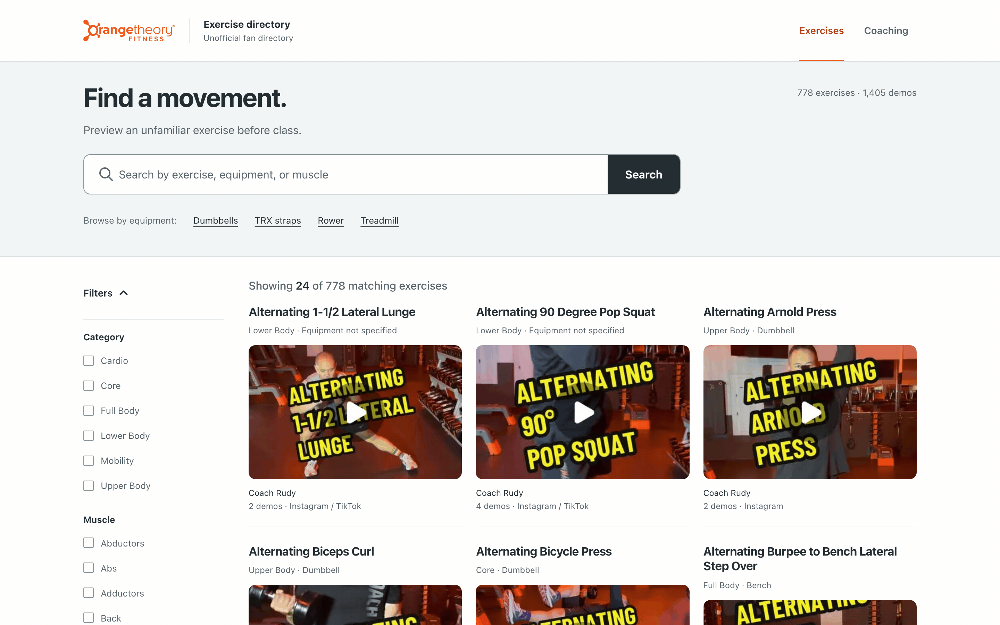
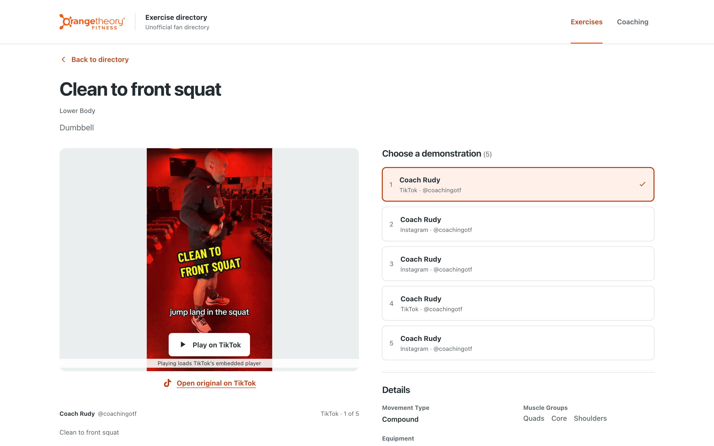
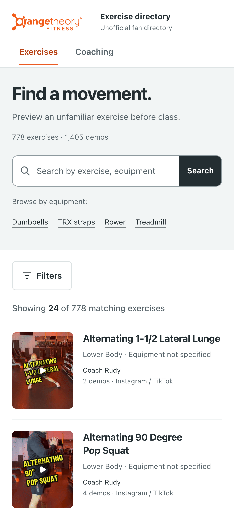

# OTF Exercise Directory (unofficial)

**Live:** [o-tf-exercises.vercel.app](https://o-tf-exercises.vercel.app)

In an Orangetheory class the coach calls out a move like "Y-Bell cross catch to
shoulder press" and you have about ten seconds to work out what it means. This
site is a searchable directory built for that moment. It pulls the short demo
videos that OTF coaches post on Instagram and TikTok and organizes them into
**778 exercises with 1,405 demo videos** that you can search and filter. It also
has a separate library of **515 coaching resources (655 videos)** on technique,
class delivery, and programming. It works on a phone mid-class and needs no
sign-in.

> **Disclaimer:** Unofficial fan directory — not affiliated with Orangetheory
> Fitness. Videos belong to their creators. Orangetheory, OTF, and related
> logos are trademarks of their respective owners.

A native SwiftUI companion app with the same catalog and offline search is in
[vdoshi96/OTf-exercises-ios](https://github.com/vdoshi96/OTf-exercises-ios).

| Directory (desktop) | Exercise detail | Mobile |
| --- | --- | --- |
|  |  |  |

## Features

- **Fuzzy search** across exercise names, muscles, equipment, creators, cues,
  and video captions (Fuse.js, weighted fields). Results show which field
  matched ("Matched: Equipment").
- **Faceted filters** for category, muscle group, equipment, platform, and
  creator. The URL stores every filter, so any filtered view can be shared
  or bookmarked.
- **One page per exercise.** Pick between alternate demos, each credited to its
  creator. TikTok embeds and Instagram previews only load after you tap them,
  and the link to the original post works without JavaScript.
- **Durable thumbnails.** All 2,060 preview images are saved in the repo,
  because Instagram and TikTok CDN links expire.
- **Old links still work.** All 1,309 exercise URLs from an earlier version of
  the catalog still resolve. Each one opens the current page, redirects,
  offers a choice between split pages, or explains why the entry was removed.
- **Accessible and responsive.** Axe WCAG 2.1 AA checks and Chromium/WebKit
  browser tests run at 320, 390, and 1280 px widths.

## How the catalog is built

```
creator feeds ──► ingestion ──► keyword enrichment ──► reviewed curation ──► static JSON
 (IG, TikTok)     yt-dlp /       scripts/enrich_local.py   data/catalog-curation.json   src/data/*.json
                  instaloader
```

1. **Ingestion.** `yt-dlp` scans TikTok and `instaloader` plus a browser capture
   scan Instagram. Both collect post metadata (IDs, captions, timestamps) for
   the tracked creators. `scripts/refresh_incremental.py` is incremental and
   fails closed: if a scan is rate-limited or incomplete, it changes nothing.
2. **Enrichment.** `scripts/enrich_local.py` reads each caption and applies
   keyword and pattern rules to extract a name, category, muscles, equipment,
   and movement type. Re-running it over the 1,055 enrichment records that
   have no curation override reproduces every one exactly, so this rule-based
   pass generated the published metadata. `scripts/enrich_metadata.py` is a
   second version of this step that sends captions to Claude Haiku 4.5. It is
   in the repo but was not used to build the current catalog.
3. **Curation.** Every published exercise has pinned metadata in
   `data/catalog-curation.json`: 778 exercise records and 2,104 video-level
   decisions (exercise, coaching, or excluded, each with a reason).
   Unresolved candidates wait in `data/catalog-review-queue.json` until
   someone makes a decision. Integrity checks confirm that the catalog, the
   ledger, and the thumbnails agree before every build.

The app was built iteratively with AI coding agents (Cursor and Codex). Specs,
plans, audits, and QA evidence for each change are in `docs/`.

## Tech stack

- **Next.js 16** (App Router, server components, static generation for about
  1,900 pages) and **React 19**
- **TypeScript**, **Tailwind CSS 4**
- **Fuse.js**, run on the server. The client receives compact 24-item pages
  from `/api/directory`.
- **Python 3** data pipeline: yt-dlp, instaloader, and a Sharp-based
  thumbnail worker in Node
- **Playwright** and **axe-core** for browser and accessibility QA
- Hosted on **Vercel** (auto-deploys from `main`) with Vercel Web Analytics.
  Route-aware CSP, anti-framing, and privacy headers.

## Run locally

```bash
npm install
npm run dev            # http://localhost:3000
```

Requires Node 22.18 or newer.

## Tests

```bash
npm test               # data, docs, directory, security, thumbnail, catalog suites
npm run lint
npm run typecheck
npm run build          # also runs docs parity + catalog integrity first

# Browser QA against a running production build
npx next start -p 3013 &
BASE_URL=http://127.0.0.1:3013 npm run test:redesign   # 24 screen/viewport checks + axe
BASE_URL=http://127.0.0.1:3013 npm run test:e2e        # Chromium + WebKit smoke
```

## Refreshing the data

```bash
npm run refresh        # dry run: checks source completeness and candidate totals, writes nothing
npm run refresh:apply  # applies the reviewed changes, backfills thumbnails, runs integrity checks
```

`refresh:apply` holds a single repository lock for the whole run. It records
progress in `data/refresh-transaction.json` so it can recover if it crashes
partway through writing several files. For thumbnail recovery details, see
[the thumbnail pipeline](docs/thumbnail-pipeline.md). For release steps, see
the [hosting guide](hosting-guide.md).

## Project layout

```
scripts/     ingestion, enrichment, refresh workflow, thumbnails, integrity checks
data/        curation ledger, review queue, refresh state and provenance
src/app/     directory, exercise + coaching detail, privacy, API route
src/lib/     directory filtering, URL query contract, Fuse.js search
src/data/    exercises.json (778), coaching.json (515), legacy route ledger
tests/       node:test + unittest suites, Playwright browser QA
docs/        design system, plans, audits, QA evidence, screenshots
```

See [DESIGN.md](DESIGN.md) for the design system and
[PRODUCT.md](PRODUCT.md) for product intent.

## Documentation parity

Every project Markdown file has a generated HTML copy next to it. After you
edit any docs, run `npm run docs:generate`. `npm run docs:check` runs before
every build and fails if an HTML copy is missing or out of date.
