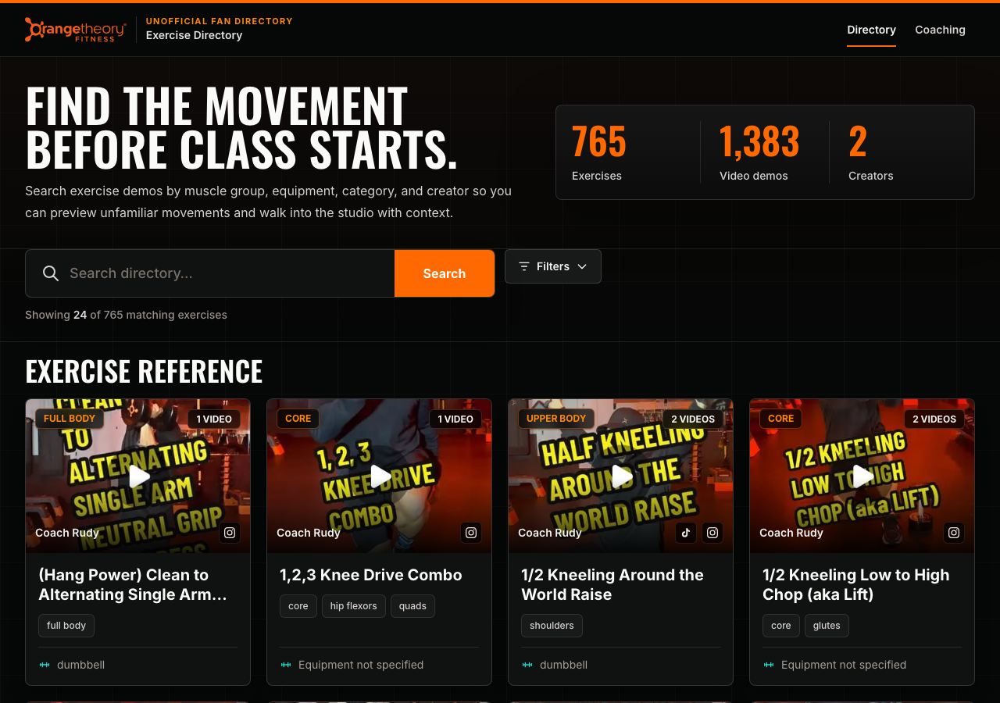
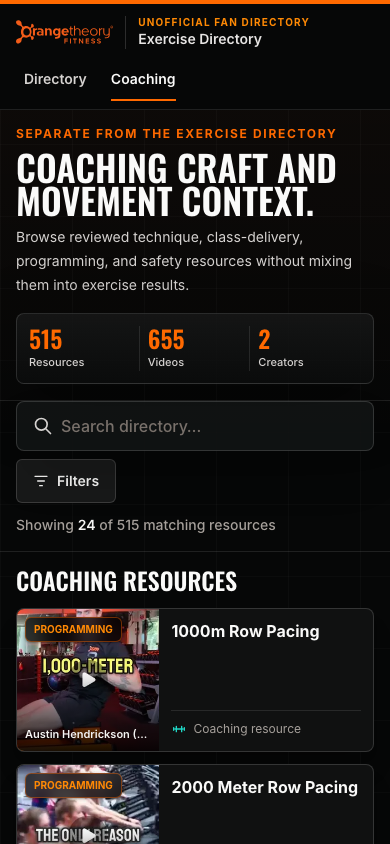

# Design QA — 2026-08-14 web audit remediation

**Final result: PASSED**

## Scope

This is the newest QA record for the web-audit remediation. It covers the
unofficial identity, reviewed exercise/coaching separation, bounded server
paging, URL state, historical exercise links, mobile filtering, compact detail
layout, outbound Instagram treatment, click-gated TikTok, privacy and recovery
routes, reduced motion, catalog-backed security policy, robots, and exact
sitemap coverage.

The screenshots below are the retained newest evidence set, captured from the
same final local production build used by the passing Chromium and WebKit
matrix. Each image was visually inspected after capture; older completed-run
evidence was removed.

## Annotated visual evidence

### 1. Desktop exercise directory — 1280 × 900

Annotations:

1. The retained official logo is immediately paired with the visible
   `UNOFFICIAL FAN DIRECTORY` identity.
2. The hero reports the reviewed public scope: 765 exercises and 1,383 videos.
3. The closed filter control occupies only its useful toolbar area.
4. `Showing 24 of 765` makes the universal 24-item first batch explicit.
5. Four compact cards fit across the first desktop row without rendering the
   full catalog.

### 2. Mobile exercise directory — 390 × 844

Annotations:

1. Both `Unofficial fan directory` and `Exercise Directory` remain visible at
   the mobile breakpoint.
2. Search retains semantic mobile sizing while the authored Filters button
   shrinks to content and wraps below it.
3. The first batch count remains 24, matching desktop.
4. Cards use a compact horizontal presentation with local previews and reviewed
   equipment labels or an honest unspecified state.

### 3. Mobile filter dialog — 390 × 844

Annotations:

1. The closed page has no full-width filter tray; a modal bottom sheet appears
   only after activation.
2. Category, muscle, equipment, source, and creator dimensions remain separate.
3. Controls meet the mobile touch-target and focus-return checks.
4. Clear and result actions stay visible above the safe-area inset.

### 4. Longest exercise title — 390 × 844

Annotations:

1. Responsive `clamp()` sizing remains legible without horizontal overflow.
2. Duplicate pre-video metadata is absent from the hero.
3. The Video library and first source control appear within the initial mobile
   viewport, before secondary metadata in DOM and visual order.
4. Instagram is identified as a source and links outward rather than mimicking
   an inline player.

### 5. Separate coaching directory — 390 × 844

Annotations:

1. The active Coaching tab and `SEPARATE FROM THE EXERCISE DIRECTORY` label make
   the content boundary explicit.
2. The page reports 515 reviewed resources and 655 videos.
3. Coaching cards expose controlled topics and never invent exercise muscles or
   equipment.
4. Coaching search and filtering use the same 24-item URL-backed paging model.

## Catalog and integrity findings

- Two independent all-catalog semantic passes plus targeted thumbnail review
  produced one durable decision for every public video: 1,383 exercise, 655
  coaching, and 43 controlled exclusions. The ledger contains 2,081 decisions
  because it also preserves nine preexisting legacy-refresh exclusions outside
  the 2,072-video public baseline.
- Every one of the 765 exercise groups and 515 coaching resources has exact
  reviewed destination metadata. Public exercises have no `other` category,
  blank muscle list, duplicate normalized title, or unreviewed cue.
- Implicit Bodyweight fallback is gone. Weighted-title contradictions were
  reviewed from local evidence; the final detector has only three controlled
  `support-only-is-complete` exceptions (two bench-supported movements and one
  BOSU-as-load movement).
- Exercises, coaching, and 34 baseline exclusions account for all 2,072
  original public video IDs. Nine additional historical refresh exclusions are
  now migrated into the same controlled ledger.
- Public media has 2,037 exact local thumbnails plus one explicit local
  fallback, with no remote or empty references. The fallback visibly says
  `UNOFFICIAL FAN DIRECTORY`; excluded canonical assets are not shipped.
- All 1,309 baseline exercise slugs remain resolved: 714 are still canonical,
  546 permanently redirect, 18 render split choosers, and 31 render
  reviewed-removal recovery pages. Unknown slugs remain true 404s.
- The unresolved review queue and all legacy override maps are empty. The
  refresh journal is idle and the stable lock covers importer, thumbnail, and
  integrity work.

## Automated verification

All release checks passed:

- Refresh and transaction tests: 26 passed.
- Directory query and search tests: 9 passed.
- Security and trust-copy tests: 5 passed.
- Thumbnail tests: 15 passed.
- Catalog plus historical-route tests: 11 passed; the live integrity gate
  reports 765 exercise groups, 515 coaching resources, 43 exclusions, and 2,038
  unique public thumbnails.
- Deterministic historical-route regeneration/check: passed for 595 mapped
  legacy slugs.
- Documentation tests: 9 passed; canonical HTML parity passed for all 26
  project-owned documentation sources.
- Default lint, TypeScript, Python syntax, shell syntax, and diff checks passed.
- The Next.js 16.3.0 Webpack production build compiled and typechecked 1,884
  static pages. The canonical Turbopack worker could not bind its local CSS
  helper in this managed host sandbox (`EPERM`); this was an environment limit,
  not an application compile failure.
- Chromium and WebKit passed at 1280×900, 390×844, and 320×844; Chromium also
  passed the reduced-motion and JavaScript-disabled variants.
- Browser assertions passed for 24/48 paging; Cardio search/filter parity;
  alias and match-reason behavior;
  malformed/repeated URL canonicalization; Back, Forward, refresh, share, and
  detail-back restoration; rapid-input stale-response protection; click-during-
  loading URL authority; Load more focus; one authored search clear; active
  navigation; longest-title layout; filter-dialog focus/touch targets;
  historical redirect/split/removal routes; custom true 404; privacy; media
  request gates; and absence of full-catalog home/client sentinels.
- JavaScript-disabled assertions passed for second-to-last and terminal paging
  in both sections plus hostile `page=100` HTML, DOM, and standalone RSC bounds.
- HTTP assertions passed for home, current and missing details, legacy outcomes,
  coaching, privacy, robots, the exact 1,283-URL canonical sitemap, and default
  `frame-src 'none'` on every missing/recovery response.

## Bounded media claim

Automated TikTok checks use a locally intercepted player document to verify the
activation gate, one outbound player request, iframe attributes, focus,
responsiveness, strict-origin referrer policy, and fullscreen permission in
both engines. They do not prove third-party playback or actual fullscreen
operation, so this QA record makes no such claim. Instagram is verified as an
explicit outbound action with no pre-activation third-party request.
