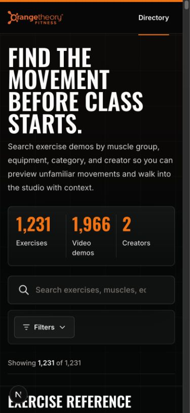
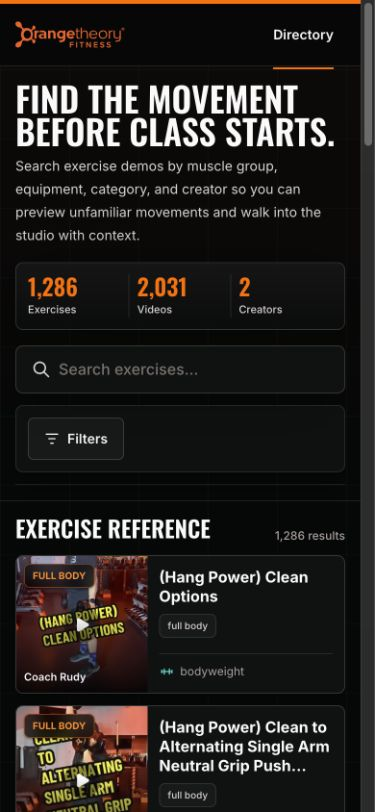
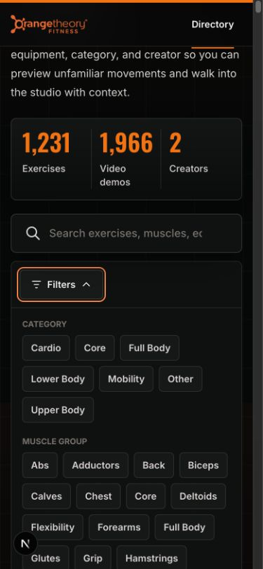
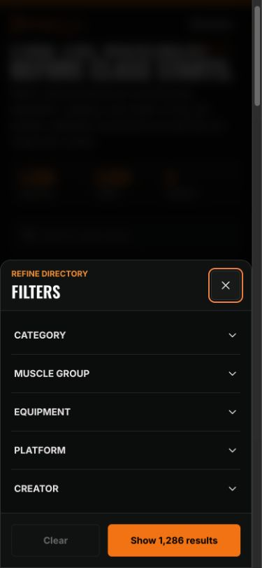
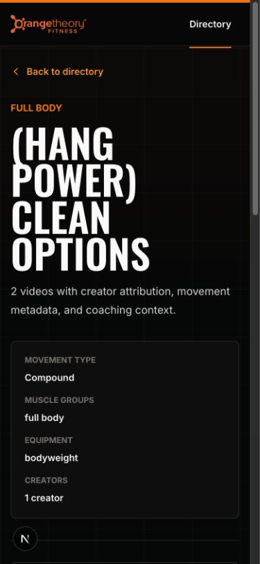

# Design QA — 2026-07-16 refresh

**Final result: PASSED**

## Source truth

The desktop visual language, colors, typography, card hierarchy, and supplied
mobile baseline screenshots were treated as the source of truth. The mobile
changes were limited to density, discovery, filters, result rows, detail order,
and video activation behavior.

## Mobile comparisons

All comparison screenshots below use the same 375 × 812 captured content area.
The production browser suite separately exercises the requested 390 × 844 CSS
viewport and a 320px overflow viewport.

| State | Baseline | Final implementation |
| --- | --- | --- |
| Directory |  |  |
| Filters open |  |  |
| Exercise detail |  |  |

## Additional evidence

- [Desktop directory](desktop-directory-1280x900.png)
- [Activated mobile TikTok player](mobile-tiktok-active-390x844.png)
- [Thumbnail coverage report](thumbnail-report.json)

## Findings and fixes

- The first exercise is now visible in the initial mobile viewport.
- The former 52-chip inline wall is replaced by a native-dialog bottom sheet
  with grouped accordions, sticky actions, 44px targets, Escape handling, and
  trigger focus restoration.
- Mobile cards are compact thumbnail-left rows; 24 are initially visible and
  load-more pagination resets when the result set changes. Desktop retains the
  complete grid without pagination.
- The detail page moves the video library before secondary facts and reduces
  title size and vertical padding on mobile.
- TikTok keeps a local preview until activation, inserts a responsive player,
  moves keyboard focus to it, and preserves the original-post link.
- No horizontal overflow was found at 390px or 320px.

## Automated browser matrix

- Chromium desktop 1280 × 900: passed
- Chromium mobile 390 × 844: passed
- Chromium mobile 320 × 844: passed
- WebKit mobile 390 × 844: passed
- Catalog routes in sitemap: 1,287 of 1,287
- Local browser console, page, request, and HTTP failure checks: passed
