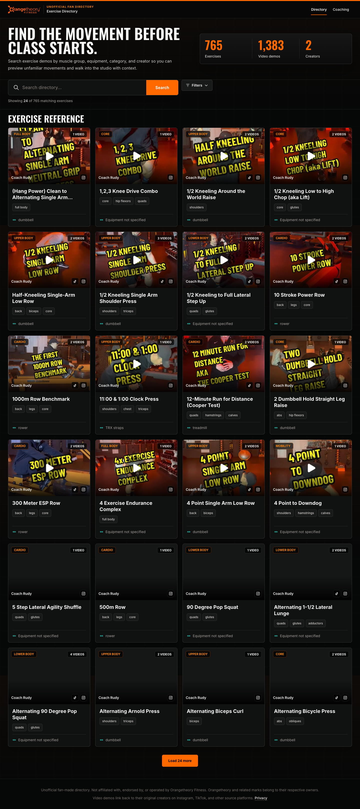
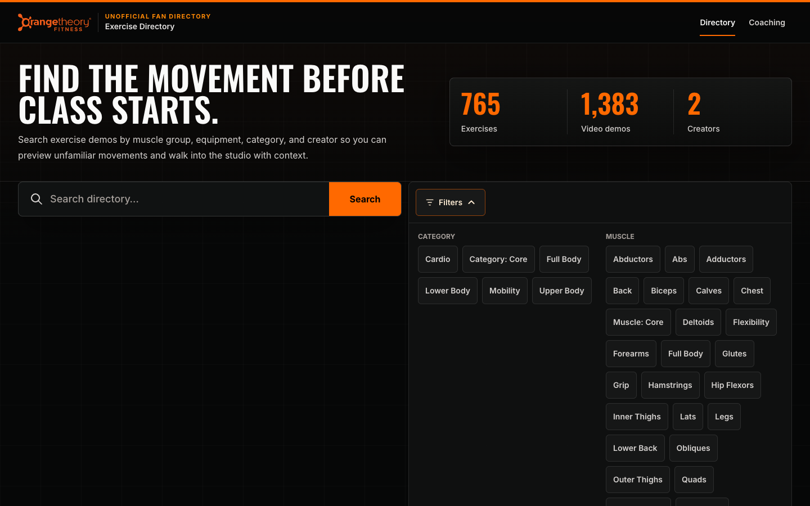
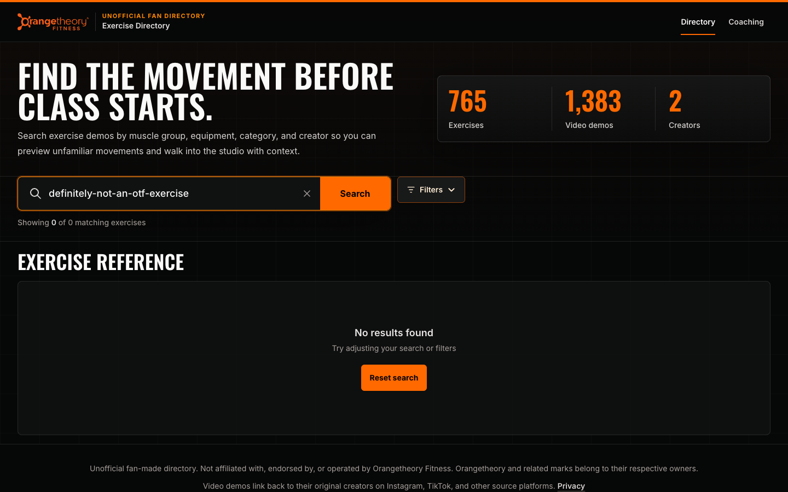
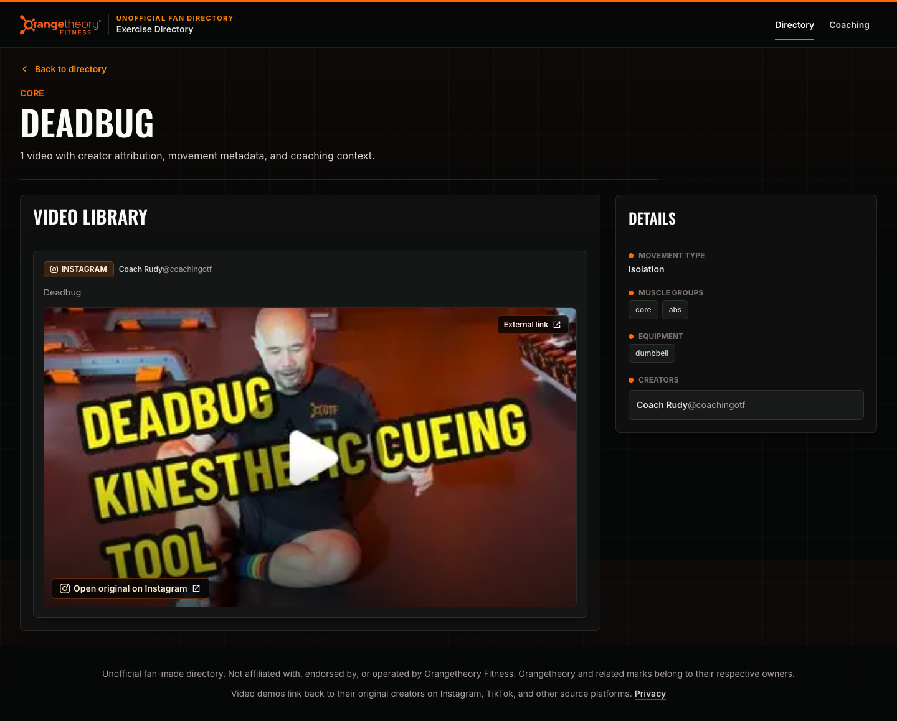
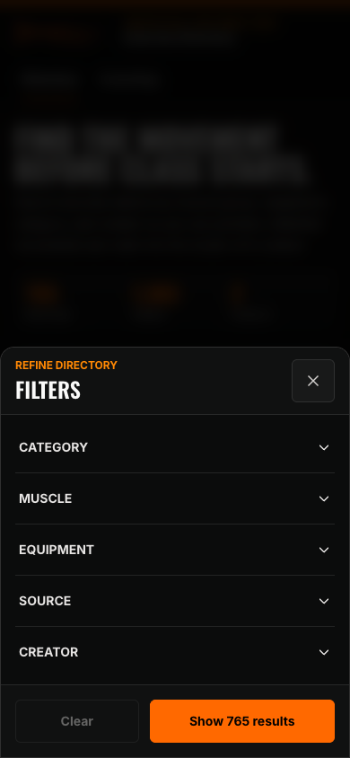
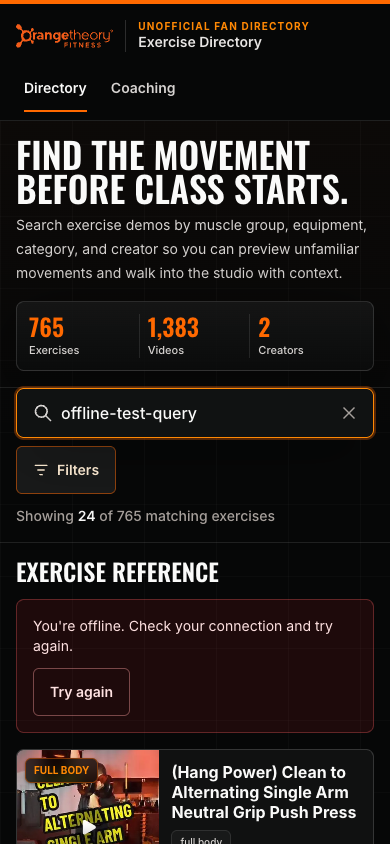

# Design QA — 2026-08-23 UI/UX audit

**Final local result: CONDITIONAL PASS**

The exercise and coaching directories pass the tested core flows, visual review,
responsive checks, accessibility scan, performance budget, and Chromium/WebKit
production-browser matrix. The qualifier is narrow and explicit: navigating to
the intentional custom 404 produces one browser-generated 404 console error.
The five tested 200 routes are console-clean.

## Before and after

### Desktop directory — 1440 × 900

| Before | After |
| --- | --- |
|  |  |

The visual identity and information density are intentionally unchanged. The
after state uses accessible black text on the orange Search action, clearer
secondary text, and 48-pixel primary targets.

### Mobile directory — 390 × 844

| Before | After |
| --- | --- |
|  |  |

The mobile header, navigation, search clear control, filters, chips, detail
actions, privacy CTA, and recovery controls now use at least 48-pixel targets.
The hidden skip link and inline footer Privacy link use the relevant target-size
exceptions.

## Affected states rechecked

### Desktop disclosure and recovery

| Filter disclosure | Empty-state recovery | Detail contrast |
| --- | --- | --- |
|  |  |  |

Escape collapses the filter disclosure and restores focus. Empty results expose
an adjacent Reset search action. Representative creator and secondary metadata
text now passes the automated contrast scan.

### Mobile filter sheet

The native dialog has explicit expanded state, focus containment and restoration,
Escape and backdrop dismissal, persistent actions, and a 260 ms open / 200 ms
close panel transition. Reduced-motion users receive no transition.

### Offline error recovery

The directory keeps the last good results visible, explains the connection
problem in plain language, and provides a 48-pixel Try again action.

## Five most important improvements

1. Removed all axe Critical/Serious violations found in the baseline contrast
   scan across the two directories and two representative detail routes.
2. Raised important mobile targets to 48 pixels across all six audited routes.
3. Made desktop filters close with Escape, update `aria-expanded`, leave the
   accessibility tree while collapsed, and restore focus to the trigger.
4. Added direct Reset search and Clear filters actions to the empty state, plus
   human-readable offline and generic request errors.
5. Replaced ad hoc state motion with tokenized filter accordion, bottom-sheet,
   and loading-shimmer transitions that respect `prefers-reduced-motion`.

## Verification

- Zero axe violations on six routes; each route retains one axe incomplete item
  for manual review rather than an automated failure.
- Zero layout clipping at 375, 768, 1024, 1280, 1440, and 1920 pixels.
- Zero network 5xx responses.
- Five real 200 routes: zero console errors and warnings.
- Intentional unknown route: true HTTP 404 and one raw browser 404 console error.
- Local after metrics: LCP 68 ms, CLS 0, INP 24 ms.
- Chromium and WebKit pass at 1280×900, 390×844, and 320×844; Chromium also
  passes reduced-motion and JavaScript-disabled variants.
- Catalog, directory, security, thumbnail, documentation, and refresh suites,
  lint, TypeScript, and the 1,884-page Next.js production build pass.

The full findings, interaction manifest, stress coverage, and remaining caveats
are in [the canonical audit](../../audits/2026-08-23-ui-ux-audit.md).
